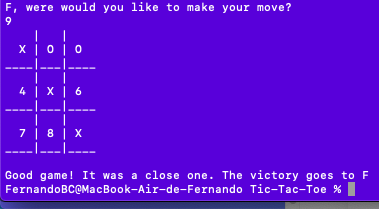
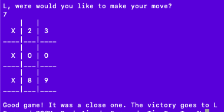
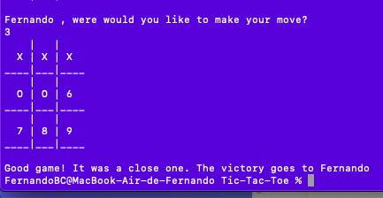

# Tic-Tac-Toe

## Instructions

**Goal of the game**

> Tic-tac-toe is a two-player game in which the goal is to create a 3 in-a-row sequence of your symbol inside a 3x3 grid. The sequence can either be vertical, horizontal, or diagonal. Here are some screenshots:







**Rules**

- Each player should take a turn to place the symbol in an empty square.
- For this implementation, player one will have the symbol "X" and player two the symbol "O".
- If all squares are occupied by a symbol and there is no winning combination then the game is considered a tie.

## Built With

- Ruby
- VSCode
- Github

## Getting Started

To get a local copy of the repository please run the following commands on your terminal:

```
$ cd <folder>
```

```
$ git clone git@github.com:ferbaco86/Tic-Tac-Toe.git
```

## To play the game

Please open your terminal and go to the folder where the local copy of the repository is using:

```
$ cd <folder>
```

Then type:

```
$ main
```

And start playing! Enjoy!

## Author

👤 **Luis Angel Maldonado**

- Github: [@lmaldonadoch](https://github.com/lmaldonadoch)
- Twitter: [@LuisAngelMCh](https://twitter.com/LuisAngelMCh)
- LinkedIn: [lmaldonadoch](https://www.linkedin.com/in/luis-angel-maldonado-5b503a1a3/)

👤 **Fernando Bahamodes**

- Github: [@ferbaco86](https://github.com/ferbaco86)
- Twitter: [@ferbac0](https://twitter.com/ferbac0)
- LinkedIn: [LinkedIn](https://www.linkedin.com/in/fernando-bahamondes-correa/)

## Potencial Features

- Update the CLI for a GUI for game playing

## 🤝 Contributing

Contributions, issues and feature requests are welcome!

Feel free to check the [issues page](https://github.com/ferbaco86/Tic-Tac-Toe/issues).

## Show your support

Give a ⭐️ if you like this project!

## Acknowledgments

- Project inspired by Microverse Program.
- Project originally taken from [The Odin Project](https://www.theodinproject.com/courses/ruby-programming/lessons/oop)
